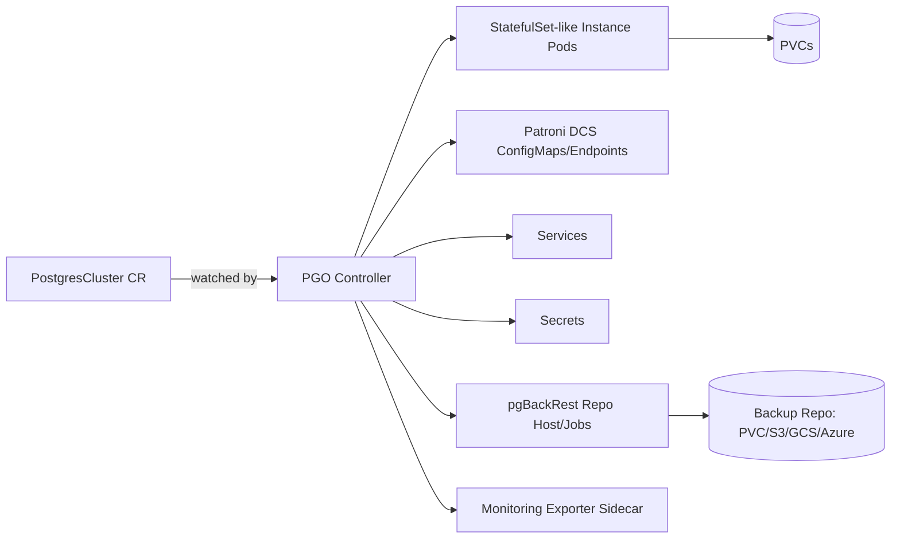
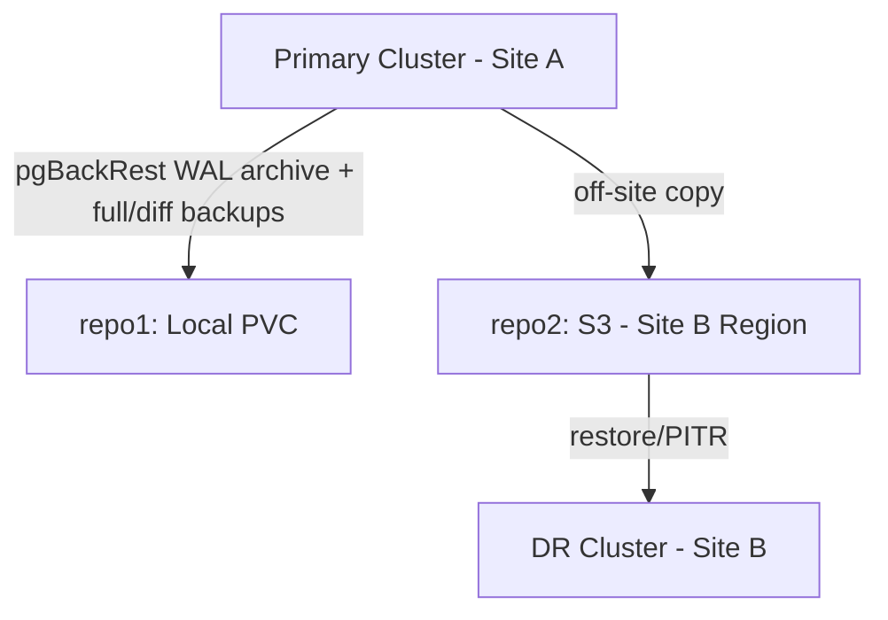

# Crunchy Data PostgreSQL Operator (PGO) — Production Operations Guide

> Scope: This guide assumes PGO is already installed and the operator pod is running in the `postgres-operator` namespace. It focuses on deploying, operating, and troubleshooting `PostgresCluster` resources in production. Official reference: https://access.crunchydata.com/documentation/postgres-operator/latest

---

## Table of Contents

1. Introduction
2. Deploying a PostgreSQL Cluster
3. Understanding Every Important CRD
4. PostgreSQL Configuration
5. Patroni Configuration
6. Resource Management
7. Storage
8. Backup Management
9. Restore Operations
10. Disaster Recovery
11. High Availability Operations
12. Scaling
13. Day-2 Operations
14. Monitoring
15. Troubleshooting Guide
16. Production Best Practices
17. Appendix

---

## 1. Introduction

### 1.1 Prerequisites (brief)

- A Kubernetes cluster (v1.24+) with a working CSI storage provisioner (e.g. Rook-Ceph, EBS, GCE PD).
- PGO installed and its `pgo` deployment `Running` in the `postgres-operator` namespace, with CRDs registered (`postgresclusters.postgres-operator.crunchydata.com`, `pgupgrades...`, `pgadmins...`).
- `kubectl` and (optionally) the `kubectl-pgo` plugin configured against the target cluster.
- A dedicated namespace per environment/application (e.g. `db-ns`) — PGO does not require clusters to live in its own namespace.

### 1.2 PGO Architecture Overview

PGO is a Kubernetes Operator: a controller that watches `PostgresCluster` custom resources and reconciles the actual cluster state (Pods, Services, PVCs, Secrets, Jobs) to match the declared spec. It runs as a single Deployment (`pgo`) with cluster-wide or namespace-scoped RBAC, using the standard controller-runtime reconcile loop (watch → diff → apply).



### 1.3 CRDs Involved

| CRD | Purpose |
|---|---|
| `PostgresCluster` | Primary resource describing an entire Postgres cluster: instances, storage, backups, monitoring, users, Patroni/PostgreSQL config |
| `PGUpgrade` | Drives major-version PostgreSQL upgrades (e.g. 13 → 16) |
| `PGAdmin` | Deploys a pgAdmin web UI bound to one or more clusters |
| (Implicit) StatefulSets, Jobs, Services, Secrets, ConfigMaps | Native Kubernetes resources generated and owned by PGO |

### 1.4 Reconciliation Workflow

1. User applies/edits a `PostgresCluster` manifest.
2. PGO's controller receives the watch event and re-reconciles the whole object graph for that cluster.
3. PGO generates/updates: Secrets (passwords, certs), ConfigMaps (Patroni DCS bootstrap config), PVCs, Pods (instance + repo host + exporter sidecars), Services (primary, replica, pgBouncer), and pgBackRest Jobs (backup/repo-init).
4. Patroni (running inside each instance pod) independently manages leader election, replication topology, and failover using the Kubernetes `Endpoints`/`ConfigMap` (or Kubernetes-native DCS) as its distributed configuration store.
5. PGO continuously reconciles drift — manual edits to generated objects (e.g. a raw StatefulSet) will be reverted on the next reconcile loop; always change the `PostgresCluster` spec instead.

### 1.5 High Availability Architecture

PGO's HA model layers Patroni on top of Kubernetes:

- Each **instance** in `spec.instances[].replicas` becomes a Postgres pod running Patroni as PID 1's supervisor for `postgres`.
- Patroni members register themselves in a distributed configuration store (DCS) — by default Kubernetes `Endpoints`/`Leases`, no external etcd required.
- On primary failure, Patroni performs leader election among healthy, sufficiently caught-up replicas and promotes one automatically.
- Readiness/liveness probes gate traffic — the `-primary` and `-replicas` Services always route to the current roles, not to fixed pod names.

### 1.6 Patroni Overview

Patroni is the HA orchestrator embedded in every Postgres container PGO deploys. It watches the DCS for leader keys, performs periodic health checks (`ttl`, `loop_wait`), and issues `pg_ctl promote`/demote actions as needed. All Patroni behavior is configured under `spec.patroni.dynamicConfiguration` in the `PostgresCluster` spec (see Section 5).

### 1.7 pgBackRest Overview

pgBackRest is PGO's built-in backup/restore/WAL-archiving tool. Every cluster gets at least one pgBackRest **repository** (`spec.backups.pgbackrest.repos[]`), which can be a PVC, S3, GCS, or Azure Blob target. pgBackRest handles full/differential/incremental backups, retention, and point-in-time recovery (PITR) via continuous WAL archiving.

### 1.8 Service Topology

| Service | Selector/Purpose |
|---|---|
| `<cluster>-ha` | Points to the current Patroni leader (primary) — read/write |
| `<cluster>-replicas` | Points to all ready replicas — read-only load balancing |
| `<cluster>-pgbouncer` | Connection-pooled endpoint if pgBouncer is enabled |
| `<cluster>-exporter` (via pod) | Prometheus metrics endpoint (port 9187) |
| `<cluster>-pods` (headless) | Direct pod DNS for internal Patroni/replication traffic |

### 1.9 Secrets Generated

| Secret | Contents |
|---|---|
| `<cluster>-pguser-<username>` | Username, password, connection URI/host/port/dbname for each declared user |
| `<cluster>-cluster-cert` | Server TLS certificate/key + CA (or the `customTLSSecret` you provide) |
| `<cluster>-replication-cert` | Replication user TLS material |
| `<cluster>-pgbackrest` | pgBackRest configuration and repo credentials |
| `<cluster>-monitoring` | Exporter credentials |

### 1.10 PVC Layout

| PVC | Attached To | Purpose |
|---|---|---|
| `<cluster>-instance-*-data` (or named per `dataVolumeClaimSpec`) | Instance pod | PGDATA |
| `<cluster>-instance-*-wal` | Instance pod (if `walVolumeClaimSpec` set) | Dedicated WAL volume |
| `<cluster>-repo1` | pgBackRest repo host pod | Local backup repository (if using `volume` repo type) |

### 1.11 Important Kubernetes Resources Created

StatefulSets/Deployments (per-instance pods), Services, Secrets, ConfigMaps, PersistentVolumeClaims, Jobs/CronJobs (backups, repo-host init, pgBackRest stanza-create), Endpoints/Leases (Patroni DCS), and optionally PodDisruptionBudgets if you add them manually (PGO does not create PDBs by default — see Section 16).

---

## 2. Deploying a PostgreSQL Cluster

Below is a fully-featured example `PostgresCluster` manifest. Replace placeholder names, credentials, and storage classes for your environment. **Generic names used**: cluster `appdb`, database `appdb`, user `appuser`, namespace `db-ns`.

```yaml
apiVersion: v1
kind: Secret
metadata:
  name: appdb-pguser-appuser
  namespace: db-ns
  labels:
    postgres-operator.crunchydata.com/cluster: appdb
    postgres-operator.crunchydata.com/pguser: appuser
type: Opaque
stringData:
  user: appuser
  password: "CHANGE_ME_STRONG_PASSWORD"
  dbname: appdb
---
apiVersion: v1
kind: Secret
metadata:
  name: appdb-s3-creds
  namespace: db-ns
type: Opaque
stringData:
  repo1-s3-key: "CHANGE_ME_S3_ACCESS_KEY"
  repo1-s3-key-secret: "CHANGE_ME_S3_SECRET_KEY"
---
apiVersion: postgres-operator.crunchydata.com/v1beta1
kind: PostgresCluster
metadata:
  name: appdb
  namespace: db-ns
  labels:
    pg-cluster: appdb
    environment: production
  annotations:
    team: platform-engineering
spec:
  postgresVersion: 16
  image: registry.developers.crunchydata.com/crunchydata/crunchy-postgres:ubi8-16.4-2

  # ---- Instances (primary instance set + optional additional sets) ----
  instances:
    - name: instance1
      replicas: 3
      priorityClassName: "postgres-critical"
      labels:
        workload: primary-set
      metadata:
        annotations:
          custom.io/backup-tier: "gold"
      resources:
        requests:
          cpu: "2"
          memory: "4Gi"
        limits:
          cpu: "4"
          memory: "8Gi"
      tolerations:
        - key: "dedicated"
          operator: "Equal"
          value: "database"
          effect: "NoSchedule"
      nodeAffinity: {}
      affinity:
        podAntiAffinity:
          requiredDuringSchedulingIgnoredDuringExecution:
            - topologyKey: kubernetes.io/hostname
              labelSelector:
                matchLabels:
                  postgres-operator.crunchydata.com/cluster: appdb
                  postgres-operator.crunchydata.com/instance-set: instance1
        nodeAffinity:
          requiredDuringSchedulingIgnoredDuringExecution:
            nodeSelectorTerms:
              - matchExpressions:
                  - key: db
                    operator: In
                    values: ["enabled"]
      topologySpreadConstraints:
        - maxSkew: 1
          topologyKey: topology.kubernetes.io/zone
          whenUnsatisfiable: ScheduleAnyway
          labelSelector:
            matchLabels:
              postgres-operator.crunchydata.com/cluster: appdb
      dataVolumeClaimSpec:
        accessModes: ["ReadWriteOnce"]
        storageClassName: rook-ceph-block
        resources:
          requests:
            storage: 50Gi
      walVolumeClaimSpec:
        accessModes: ["ReadWriteOnce"]
        storageClassName: rook-ceph-block-fast
        resources:
          requests:
            storage: 10Gi

    # Optional second instance set (e.g. dedicated to reporting replicas)
    - name: instance2
      replicas: 1
      resources:
        requests:
          cpu: "1"
          memory: "2Gi"
        limits:
          cpu: "2"
          memory: "4Gi"
      dataVolumeClaimSpec:
        accessModes: ["ReadWriteOnce"]
        storageClassName: rook-ceph-block
        resources:
          requests:
            storage: 50Gi

  # ---- Users and Databases ----
  users:
    - name: appuser
      databases: ["appdb"]
      options: "CREATEROLE"
    - name: readonlyuser
      databases: ["appdb"]
      options: "NOSUPERUSER NOCREATEDB NOCREATEROLE"

  # ---- TLS (custom certs; omit to let PGO generate its own) ----
  customTLSSecret:
    name: appdb-cluster.tls
  customReplicationTLSSecret:
    name: appdb-replication.tls

  # ---- Service Configuration ----
  service:
    type: ClusterIP
    metadata:
      annotations:
        service.beta.kubernetes.io/custom-annotation: "true"

  # ---- pgBouncer (connection pooling) ----
  proxy:
    pgBouncer:
      replicas: 2
      image: registry.developers.crunchydata.com/crunchydata/crunchy-pgbouncer:ubi8-1.22-2
      resources:
        requests:
          cpu: "0.5"
          memory: "256Mi"
        limits:
          cpu: "1"
          memory: "512Mi"
      config:
        global:
          pool_mode: transaction
          max_client_conn: "1000"
          default_pool_size: "50"

  # ---- Monitoring (pgMonitor exporter) ----
  monitoring:
    pgmonitor:
      exporter:
        image: registry.developers.crunchydata.com/crunchydata/crunchy-postgres-exporter:ubi8-5.1.1-0
        resources:
          requests:
            cpu: "0.1"
            memory: "128Mi"
          limits:
            cpu: "0.2"
            memory: "256Mi"

  # ---- Patroni Configuration ----
  patroni:
    leaderLeaseDurationSeconds: 30
    syncPeriodSeconds: 10
    port: 8008
    dynamicConfiguration:
      synchronous_mode: false
      postgresql:
        parameters:
          max_connections: "300"
          shared_buffers: "2GB"
          effective_cache_size: "6GB"
          work_mem: "16MB"
          maintenance_work_mem: "512MB"
          wal_level: "replica"
          wal_buffers: "16MB"
          checkpoint_timeout: "15min"
          checkpoint_completion_target: "0.9"
          max_wal_size: "4GB"
          min_wal_size: "1GB"
          random_page_cost: "1.1"
          effective_io_concurrency: "200"
          default_statistics_target: "100"
          autovacuum: "on"
          autovacuum_max_workers: "4"
          log_min_duration_statement: "500"
          log_checkpoints: "on"
          log_connections: "on"
          log_disconnections: "on"

  # ---- Backups (pgBackRest) ----
  backups:
    pgbackrest:
      image: registry.developers.crunchydata.com/crunchydata/crunchy-pgbackrest:ubi8-2.53-2
      configuration:
        - secret:
            name: appdb-s3-creds
      global:
        repo1-retention-full: "7"
        repo1-retention-full-type: count
        repo2-retention-full: "4"
      repos:
        - name: repo1
          schedules:
            full: "0 1 * * 0"
            differential: "0 1 * * 1-6"
          volume:
            volumeClaimSpec:
              accessModes: ["ReadWriteOnce"]
              storageClassName: rook-ceph-block
              resources:
                requests:
                  storage: 100Gi
        - name: repo2
          schedules:
            full: "0 2 * * 0"
          s3:
            bucket: appdb-backups
            endpoint: s3.ap-southeast-1.amazonaws.com
            region: ap-southeast-1

  # ---- Restore configuration (for cloning/PITR — omit on first deploy) ----
  # dataSource:
  #   postgresCluster:
  #     clusterName: appdb-source
  #     repoName: repo1
  #     options:
  #       - --type=time
  #       - --target=2026-07-20 12:00:00+06

  # ---- Init SQL (runs once against the initial database) ----
  databaseInitSQL:
    name: appdb-init-sql
    key: init.sql
```

Companion ConfigMap for `databaseInitSQL`:

```yaml
apiVersion: v1
kind: ConfigMap
metadata:
  name: appdb-init-sql
  namespace: db-ns
data:
  init.sql: |
    CREATE EXTENSION IF NOT EXISTS pg_stat_statements;
    CREATE SCHEMA IF NOT EXISTS reporting;
```

### Field-by-field notes

| Field | Purpose |
|---|---|
| `spec.postgresVersion` / `spec.image` | Pin exact PostgreSQL major version and container image digest for reproducibility |
| `spec.instances[].replicas` | Number of Patroni-managed pods in that instance set (1 primary + N-1 replicas, dynamically elected) |
| `spec.instances[].dataVolumeClaimSpec` / `walVolumeClaimSpec` | Separate WAL storage improves write latency and isolates WAL growth from PGDATA |
| `affinity.podAntiAffinity` | Spreads replicas across nodes/failure domains — critical for real HA |
| `topologySpreadConstraints` | Spreads pods across zones, not just hosts |
| `spec.proxy.pgBouncer` | Adds a connection pooler layer, reducing backend connection churn |
| `spec.backups.pgbackrest.repos[]` | One or more backup destinations; can mix local PVC and cloud repos |
| `spec.users[].options` | Extra `CREATE ROLE` options (e.g. `CREATEROLE`, `NOSUPERUSER`) |
| `dataSource.postgresCluster` | Used only when cloning/restoring from another cluster's backups |

---

## 3. Understanding Every Important CRD

### 3.1 `PostgresCluster`

The root resource. Key top-level spec blocks: `instances`, `users`, `backups`, `monitoring`, `patroni`, `proxy`, `service`, `standby`, `dataSource`, `customTLSSecret`.

### 3.2 `PgBouncer` (`spec.proxy.pgBouncer`)

Deploys a pooling layer in front of Postgres. Use when the application opens many short-lived connections (typical for web backends) to avoid exhausting `max_connections`.

### 3.3 pgBackRest (`spec.backups.pgbackrest`)

Controls backup repositories, retention, schedules, and restore options. Supports multiple `repos[]` for redundancy (e.g. local + S3).

### 3.4 Monitoring (`spec.monitoring.pgmonitor`)

Deploys the `postgres_exporter` sidecar exposing Prometheus-format metrics on port 9187 per instance pod.

### 3.5 Secrets

PGO auto-generates and continuously reconciles password/TLS Secrets unless you provide `customTLSSecret` or pre-seed a `pguser` Secret (as shown in Section 2) with the `postgres-operator.crunchydata.com/pguser` label so PGO adopts it instead of generating a random password.

### 3.6 Services

Auto-created per cluster; do not manually edit — override via `spec.service.metadata` for annotations/type instead.

### 3.7 Jobs

PGO creates Kubernetes Jobs for: `pgbackrest stanza-create` (initial repo setup), scheduled/manual backups, and restore operations. These appear and complete, then are cleaned up according to Kubernetes' default job history.

### 3.8 StatefulSets

Each instance pod runs under a StatefulSet-like construct that guarantees stable network identity (`<cluster>-<instance>-<suffix>-0`) — required for Patroni's DCS bookkeeping and PVC binding.

### 3.9 Patroni Configuration Object

Lives entirely under `spec.patroni`. See Section 5 for detail.

### 3.10 PostgreSQL Configuration Object

Lives under `spec.patroni.dynamicConfiguration.postgresql.parameters` — PGO delegates all `postgresql.conf` management to Patroni's dynamic configuration rather than a static file.

---

## 4. PostgreSQL Configuration

All tunables are set via `spec.patroni.dynamicConfiguration.postgresql.parameters` as **strings**. Changes are applied via Patroni's REST API and, for parameters requiring a restart (e.g. `shared_buffers`), Patroni schedules a rolling restart automatically.

| Parameter | Purpose |
|---|---|
| `shared_buffers` | Postgres's dedicated shared memory cache; typically 25% of instance memory |
| `work_mem` | Per-operation sort/hash memory; too high with many connections can OOM the pod |
| `maintenance_work_mem` | Memory for VACUUM, CREATE INDEX, etc. |
| `effective_cache_size` | Planner hint for total OS+Postgres cache available; ~50-75% of memory |
| `max_connections` | Hard cap on backend connections; pair with pgBouncer to keep this modest |
| `wal_level` | `replica` (default, required for streaming replication) or `logical` for logical replication |
| `wal_buffers` | WAL write buffer, usually auto (`-1`) or 16MB |
| `checkpoint_timeout` / `max_wal_size` / `min_wal_size` | Control checkpoint frequency and WAL retention window |
| `autovacuum*` | Tune aggressiveness of the autovacuum daemon |
| `log_min_duration_statement`, `log_checkpoints`, `log_connections` | Logging/observability tuning |
| `max_parallel_workers*` | Parallel query execution tuning |
| `archive_mode` / `archive_command` | Managed internally by pgBackRest integration; do not override manually |

### Tuning Recommendations by Workload

| Workload | shared_buffers | work_mem | max_connections | Notes |
|---|---|---|---|---|
| OLTP small | 25% RAM | 4-8MB | 100-200 | Favor pgBouncer transaction pooling |
| OLTP large production | 25% RAM | 8-16MB | 200-400 (behind pgBouncer) | Separate WAL volume, tuned autovacuum |
| Analytics/reporting | 25-40% RAM | 64-256MB | 20-50 | Increase `max_parallel_workers_per_gather`, larger `maintenance_work_mem` |
| Small dev/test clusters | 128MB-512MB | 4MB | 50-100 | Minimize resource requests, single instance |

---

## 5. Patroni Configuration

Configured under `spec.patroni`:

```yaml
patroni:
  leaderLeaseDurationSeconds: 30   # ttl equivalent
  syncPeriodSeconds: 10            # retry_timeout-like heartbeat interval
  dynamicConfiguration:
    synchronous_mode: false
    synchronous_mode_strict: false
    postgresql:
      use_slots: true
      parameters:
        max_connections: "300"
```

| Setting | Safe to modify? | Notes |
|---|---|---|
| `synchronous_mode: true` | Yes | Enables synchronous replication (zero data loss on failover, higher write latency) |
| `synchronous_mode_strict` | Use with caution | Blocks all writes if no sync replica is available — only for strict RPO=0 requirements |
| `leaderLeaseDurationSeconds` (ttl) | Yes, with care | Lower = faster failure detection but more risk of false-positive failovers on transient network blips |
| `maximum_lag_on_failover` | Yes | Prevents promoting a replica that's too far behind (in bytes) |
| `retry_timeout` | Yes | How long Patroni retries a failed DCS/API operation |
| Replication slots (`use_slots`) | Yes | Keeps WAL available for replicas; monitor disk usage to avoid WAL bloat if a replica goes offline for long |
| Bootstrap `initdb` options | Only at cluster creation | Changing after cluster creation has no effect — must be set at first apply |
| Raw DCS keys / `postgresql.conf` | **Avoid manual edits** | Always go through `spec.patroni.dynamicConfiguration`; PGO will revert manual ConfigMap edits |

**Failover vs Switchover**: Failover is automatic (triggered by Patroni detecting primary failure). Switchover is a planned, manual role swap (see Section 11) and should always be used for maintenance instead of forcing a failover.

---

## 6. Resource Management

```yaml
resources:
  requests:
    cpu: "2"
    memory: "4Gi"
  limits:
    cpu: "4"
    memory: "8Gi"
```

- **CPU requests/limits**: Request should reflect steady-state usage; limit provides burst headroom. Avoid setting CPU limits equal to requests for latency-sensitive OLTP (throttling causes replication stalls).
- **Memory requests/limits**: Should be equal or very close — Postgres does not tolerate OOM-kills gracefully (can corrupt shared memory state and trigger a crash-recovery cycle).
- **HugePages**: Supported via standard Kubernetes `resources.limits["hugepages-2Mi"]` plus setting `huge_pages: try` or `on` in `postgresql.parameters`; reduces TLB pressure for large `shared_buffers`.
- **Ephemeral storage**: Set `resources.requests/limits["ephemeral-storage"]` if using emptyDir-backed temp space; monitor `pg_stat_activity` temp file usage.
- **Storage resizing / volume expansion**: Increase `dataVolumeClaimSpec.resources.requests.storage` and reapply — requires a storage class with `allowVolumeExpansion: true`. Expansion is online for most CSI drivers (including Rook-Ceph RBD) but always verify in a non-prod cluster first.
- **Instance/replica scaling**: See Section 12.

**Trade-offs**: Larger `shared_buffers`/CPU limits improve throughput but increase blast radius of node pressure; conservative requests improve schedulability but risk noisy-neighbor throttling.

---

## 7. Storage

- **Persistent Volumes**: One PV per PVC, dynamically provisioned by your CSI driver based on `storageClassName`.
- **Storage Classes**: Must support `ReadWriteOnce`; `allowVolumeExpansion: true` recommended. Common: `rook-ceph-block`, `gp3` (EBS), `pd-ssd` (GCE), `managed-premium` (Azure).
- **WAL storage**: Use `walVolumeClaimSpec` on a fast, low-latency class separate from PGDATA to isolate write-ahead log I/O.
- **Backup storage options**:

| Backend | Repo Field | Use Case |
|---|---|---|
| PVC (`volume`) | `repos[].volume` | Fast local restores, no cloud dependency |
| AWS S3 | `repos[].s3` | Off-site, durable, cheap long-term retention |
| MinIO | `repos[].s3` + `repo1-s3-uri-style: path` in `global` | Self-hosted S3-compatible storage |
| GCS | `repos[].gcs` | GCP-native clusters |
| Azure Blob | `repos[].azure` | Azure-native clusters |

- **Multiple repositories**: Configure `repo1`, `repo2`, etc. under `spec.backups.pgbackrest.repos[]` — pgBackRest can write to all simultaneously and restore from any.
- **Repository failover**: If `repo1` (e.g. local PVC) is unavailable, target `repo2` explicitly during restore with `--repo=2` in the restore options.

---

## 8. Backup Management

### Automated (scheduled) backups

```yaml
backups:
  pgbackrest:
    repos:
      - name: repo1
        schedules:
          full: "0 1 * * 0"           # Weekly full, Sunday 01:00
          differential: "0 1 * * 1-6" # Daily differential, Mon-Sat 01:00
          incremental: "0 */6 * * *"  # Incremental every 6 hours
        volume:
          volumeClaimSpec:
            accessModes: ["ReadWriteOnce"]
            storageClassName: rook-ceph-block
            resources:
              requests:
                storage: 100Gi
    global:
      repo1-retention-full: "7"
      repo1-retention-full-type: count
      repo1-retention-diff: "14"
```

### Manual (on-demand) backup

```bash
kubectl -n db-ns exec -it appdb-instance1-0 -c database -- true  # sanity check pod
kubectl-pgo backup --repoName=repo1 --options="--type=full" -n db-ns appdb
```

Or via annotation trigger:

```bash
kubectl -n db-ns annotate postgrescluster appdb \
  postgres-operator.crunchydata.com/pgbackrest-backup="$(date +%s)" --overwrite
```

### Retention & Verification

- `repo1-retention-full-type: count` retains N full backups; `time` retains by days.
- Verify a backup completed:
  ```bash
  kubectl -n db-ns exec -it appdb-repo-host-0 -- pgbackrest info --stanza=db
  ```
- Repository maintenance (expire old backups per retention policy) runs automatically after each scheduled full backup.

---

## 9. Restore Operations

### 9.1 Restore to a new cluster (clone)

```yaml
apiVersion: postgres-operator.crunchydata.com/v1beta1
kind: PostgresCluster
metadata:
  name: appdb-clone
  namespace: db-ns
spec:
  postgresVersion: 16
  instances:
    - name: instance1
      dataVolumeClaimSpec:
        accessModes: ["ReadWriteOnce"]
        storageClassName: rook-ceph-block
        resources:
          requests:
            storage: 50Gi
  backups:
    pgbackrest:
      repos:
        - name: repo1
          volume:
            volumeClaimSpec:
              accessModes: ["ReadWriteOnce"]
              storageClassName: rook-ceph-block
              resources:
                requests:
                  storage: 100Gi
  dataSource:
    postgresCluster:
      clusterName: appdb
      repoName: repo1
      options:
        - --type=immediate
```

### 9.2 Point-in-Time Recovery (PITR)

```yaml
  dataSource:
    postgresCluster:
      clusterName: appdb
      repoName: repo1
      options:
        - --type=time
        - --target=2026-07-20 12:00:00+06
```

### 9.3 In-place restore (destructive — restores over the existing cluster)

```bash
kubectl -n db-ns annotate postgrescluster appdb \
  postgres-operator.crunchydata.com/pgbackrest-restore="$(date +%s)" --overwrite
```
Requires setting `spec.backups.pgbackrest.restore` options beforehand, e.g.:
```yaml
spec:
  backups:
    pgbackrest:
      restore:
        enabled: true
        repoName: repo1
        options:
          - --type=time
          - --target=2026-07-20 12:00:00+06
```

### 9.4 Restore from S3/MinIO or another cluster's remote repository

Same `dataSource.postgresCluster` block; point `repoName` at the S3/MinIO-backed repo (e.g. `repo2`), and ensure the new cluster's namespace has access to the same S3 credentials Secret referenced in `spec.backups.pgbackrest.configuration`.

**Step-by-step**:
1. Confirm the source repo has a valid, complete backup (`pgbackrest info`).
2. Create the target `PostgresCluster` manifest with matching `postgresVersion` and a `dataSource.postgresCluster` block.
3. Apply and monitor: `kubectl -n db-ns get pods -w`.
4. Verify recovery completed: `psql -c "select pg_is_in_recovery();"` should return `f` once promoted.

---

## 10. Disaster Recovery

### 10.1 DR Architecture



- **Cross-cluster recovery**: A DR cluster in a different namespace/region restores from the same `repo2` (S3) using `dataSource.postgresCluster` pointing at the primary's cluster name and repo.
- **Off-site backups**: Always configure at least one cloud (`s3`/`gcs`/`azure`) repo in addition to local PVC, so a full-site outage doesn't destroy all backups.
- **Cluster cloning**: Use the same restore-to-new-cluster pattern (Section 9.1) for creating staging/QA copies from production backups.
- **Recommended DR strategy**: Combine (a) a warm standby cluster using `spec.standby.enabled: true` streaming from the primary over a NodePort/LoadBalancer, and (b) periodic S3 backups for cold-start recovery if the standby itself is unavailable.
- **RPO/RTO considerations**:

| Strategy | RPO | RTO |
|---|---|---|
| Streaming standby (async) | Seconds to low minutes | Minutes (manual switchover) |
| Streaming standby (sync) | ~0 | Minutes |
| PITR from S3 backups only | Up to last WAL archive push interval | Tens of minutes to hours (restore time scales with data size) |

### 10.2 Testing DR Procedures

Regularly (quarterly minimum) perform a full restore-to-new-cluster drill in an isolated namespace using production backups, and time the process to validate your RTO assumptions.

---

## 11. High Availability Operations

### 11.1 Automatic Failover

Triggered by Patroni when the leader misses its lease renewal. No manual action needed; verify with:
```bash
kubectl -n db-ns exec -it appdb-instance1-0 -- patronictl list
```

### 11.2 Manual Switchover (planned, zero/minimal downtime)

```bash
kubectl -n db-ns exec -it appdb-instance1-0 -- patronictl switchover --master appdb-instance1-0 --candidate appdb-instance1-1 --force
```

### 11.3 Manual Failover (forces promotion even if leader is reachable — use cautiously)

```bash
kubectl -n db-ns exec -it appdb-instance1-0 -- patronictl failover --candidate appdb-instance1-1
```

### 11.4 Replica Rebuild (after prolonged lag or corruption)

```bash
kubectl -n db-ns exec -it appdb-instance1-1 -- patronictl reinit appdb-instance1 appdb-instance1-1 --force
```

### 11.5 Handling Node/Pod/PVC Failures

| Failure | Expected Outcome | Action if stuck |
|---|---|---|
| Node failure | Pod reschedules elsewhere (if PVC access mode/topology allows); Patroni fails over if primary | Cordon/drain node; check `VolumeAttachment` objects (Section 15.9) |
| Pod crash (non-primary) | Kubernetes restarts container; Patroni re-syncs | `kubectl delete pod` to force recreation if stuck |
| PVC failure/unbound | Pod stuck `Pending` | Verify storage class capacity/provisioner health |
| Network partition | Patroni may demote isolated primary to avoid split-brain (with proper `maximum_lag_on_failover`/quorum settings) | Investigate CNI/network policy; never manually force two primaries live simultaneously |

---

## 12. Scaling

- **Vertical scaling**: Edit `spec.instances[].resources` and reapply; causes a rolling pod restart.
- **Horizontal/replica scaling**: Edit `spec.instances[].replicas`:
  ```bash
  kubectl patch postgrescluster appdb -n db-ns --type='json' \
    -p='[{"op":"replace","path":"/spec/instances/0/replicas","value":4}]'
  ```
- **Storage scaling**: Increase `dataVolumeClaimSpec.resources.requests.storage`; requires `allowVolumeExpansion: true` on the StorageClass.
- **Rolling updates / zero-downtime upgrades**: PGO rolls instance pods one at a time by default, always keeping quorum; monitor with `kubectl get pods -w` during any spec change that forces a restart (image, resources, config requiring restart).

---

## 13. Day-2 Operations

| Task | Command / Method |
|---|---|
| Add a database | Add to existing user's `databases: []` list in spec and reapply |
| Add a user | Add entry to `spec.users[]` and reapply |
| Rotate password | Delete the `pguser` secret matching the user; PGO regenerates a new password on next reconcile: `kubectl delete secret appdb-pguser-appuser -n db-ns` |
| Rotate certificates | Delete `customTLSSecret`/`customReplicationTLSSecret` (if operator-managed) to force regeneration, or supply new cert Secrets |
| Update PostgreSQL config | Edit `spec.patroni.dynamicConfiguration.postgresql.parameters`, reapply |
| Update Patroni config | Edit `spec.patroni.dynamicConfiguration`, reapply |
| Scale replicas | See Section 12 |
| Restart entire cluster | `kubectl -n db-ns annotate postgrescluster appdb postgres-operator.crunchydata.com/restart="$(date +%s)" --overwrite` |
| Restart one pod | `kubectl -n db-ns delete pod appdb-instance1-1` |
| Image upgrade (minor) | Update `spec.image` tag, reapply — rolling restart |
| PostgreSQL major version upgrade | Use `PGUpgrade` CRD (`fromPostgresVersion`/`toPostgresVersion`) |
| Operator upgrade | Apply new `config/default` kustomize/Helm release for PGO itself, following official upgrade docs |

---

## 14. Monitoring

- **pgMonitor / Prometheus**: Enable `spec.monitoring.pgmonitor.exporter`; scrape port 9187 on each instance pod.
- **Grafana**: Import Crunchy's official pgMonitor dashboards (cluster overview, replication, WAL, connections, backup status).
- **Important metrics**: `pg_up`, `pg_replication_lag`, `pg_stat_database_*`, `pg_locks_*`, `pgbackrest_backup_since_last_completion_seconds`, container CPU/memory (via `kube-state-metrics`/cAdvisor).
- **Health checks**: Patroni exposes a REST API (`:8008/health`, `/readiness`, `/leader`) used internally by Kubernetes probes.
- **Kubernetes events**: `kubectl -n db-ns get events --sort-by=.lastTimestamp`.
- **PostgreSQL logs**: `kubectl -n db-ns logs appdb-instance1-0 -c database`.
- **Patroni logs**: same pod, look for `patroni` log lines mixed into container stdout, or `kubectl -n db-ns logs appdb-instance1-0 -c database | grep patroni`.

---

## 15. Troubleshooting Guide

### 15.1 Pods stuck in Pending

- **Symptoms**: Pod never leaves `Pending`.
- **Root causes**: Unbound PVC (no matching StorageClass/capacity), insufficient node resources, anti-affinity/taints blocking scheduling.
- **Diagnostics**: `kubectl describe pod`, `kubectl get pvc`, `kubectl get storageclass`.
- **Resolution**: Fix storage class name/capacity; add matching node labels/tolerations; free node resources.
- **Prevention**: Pre-validate storage classes exist before deploying; use `kubectl get sc` in CI checks.

### 15.2 CrashLoopBackOff

- **Symptoms**: Repeated container restarts.
- **Root causes**: Bad config parameter, corrupted PGDATA, resource limits too low (OOMKill), failed WAL replay.
- **Diagnostics**: `kubectl logs <pod> -c database --previous`, `kubectl describe pod`.
- **Resolution**: Revert last config change; increase memory limits; if PGDATA corrupted, reinit from a healthy replica or restore from backup.
- **Prevention**: Test config changes in staging; set memory requests == limits.

### 15.3 Failed backups

- **Symptoms**: Backup Job shows `Error`/`Pending` forever, or `pgbackrest info` shows no recent backup.
- **Root causes**: PVC binding failure, S3 auth failure, network egress blocked, insufficient repo storage.
- **Diagnostics**: `kubectl describe job <backup-job>`, `kubectl logs <backup-job-pod>`, `pgbackrest info --stanza=db`.
- **Resolution**: Fix credentials Secret; free repo disk space; recreate the job/trigger manual backup.
- **Prevention**: Alert on backup age (>24h); test S3 credentials rotation procedures.

### 15.4 Restore failures

- **Symptoms**: New/restored cluster pod never reaches `Running`; stuck in restore Job.
- **Root causes**: Wrong `repoName`/`clusterName` in `dataSource`, mismatched `postgresVersion`, missing S3 credentials in target namespace.
- **Diagnostics**: `kubectl logs` on the restore Job pod; `pgbackrest info` from source repo.
- **Resolution**: Correct dataSource fields; ensure credentials Secret exists in the target namespace before applying.

### 15.5 PVC issues (including Rook-Ceph Multi-Attach)

- **Symptoms**: `Multi-Attach error`, `rbd image is still being used`.
- **Root causes**: Stale `VolumeAttachment` after ungraceful node loss; stale Ceph RBD watcher.
- **Diagnostics**: `kubectl get volumeattachments -A | grep <pvc-uid>`.
- **Resolution**: Cordon affected node → scale StatefulSet to 0 → delete stale `VolumeAttachment` → scale back up → uncordon. If still stuck, blacklist the stale Ceph RBD watcher via `rbd status`/`ceph osd blacklist add`.
- **Prevention**: Always drain nodes gracefully before maintenance; avoid force-deleting pods.

### 15.6 Replication lag

- **Symptoms**: `patronictl list` shows large `Lag in MB` on a replica.
- **Root causes**: Network latency, high primary write load, disk I/O contention, long-running queries on the replica.
- **Diagnostics**: `patronictl list`; `pg_stat_replication` on the primary.
- **Resolution**: Reinitialize the lagging replica: `patronictl reinit <cluster> <member> --force`; temporarily scale down replicas to let one catch up, then scale back up.
- **Prevention**: Size replicas identically to the primary; monitor lag continuously and alert above a threshold.

### 15.7 Failover failures / Patroni leader election issues

- **Symptoms**: No replica gets promoted after primary loss.
- **Root causes**: All replicas exceed `maximum_lag_on_failover`; DCS unreachable; insufficient healthy replicas for quorum.
- **Diagnostics**: `patronictl list`, `patronictl history`, check DCS (Kubernetes Endpoints/Leases) accessibility.
- **Resolution**: Manually force `patronictl failover` once you've confirmed data safety; investigate DCS connectivity/RBAC.

### 15.8 Readiness probe failures

- **Symptoms**: Pod `Ready 1/2`, traffic not routed.
- **Root causes**: Health check script timing out under load; probe `initialDelaySeconds`/`timeoutSeconds` too aggressive.
- **Resolution**: Increase `initialDelaySeconds`/`timeoutSeconds` on the readiness probe via the appropriate spec override; monitor pod resource pressure.

### 15.9 S3 authentication problems

- **Symptoms**: `archive_command failed: could not connect to S3 bucket`.
- **Root causes**: Wrong/expired keys, incorrect endpoint/region, missing IAM permissions (`s3:GetObject`, `s3:PutObject`, `s3:ListBucket`).
- **Resolution**: Recheck the `configuration[].secret` credentials Secret; validate IAM policy; test connectivity with `aws s3 ls` from a debug pod.

### 15.10 Secrets / TLS problems

- **Symptoms**: Application can't authenticate; TLS handshake failures.
- **Root causes**: Stale cached password after rotation; expired custom certs; CA mismatch between primary and standby.
- **Resolution**: Recreate the `pguser` Secret to force regeneration; ensure `customTLSSecret`/`customReplicationTLSSecret` share a common CA across all clusters expected to replicate.

### 15.11 Performance bottlenecks (CPU/memory/WAL growth/disk full)

- **Symptoms**: High CPU/memory usage; WAL directory growing unbounded; disk full alerts.
- **Root causes**: Long-running/unindexed queries; replication slot retaining WAL for an offline replica; insufficient `max_wal_size`; runaway autovacuum contention.
- **Diagnostics**: `pg_stat_activity`, `pg_replication_slots`, `du -sh` on WAL directory, `kubectl top pod`.
- **Resolution**: Kill offending queries (`pg_terminate_backend`); drop stale replication slots; increase disk/WAL volume size; tune `checkpoint_timeout`/`max_wal_size`.

### 15.12 Stuck reconciliations

- **Symptoms**: Spec changes don't take effect; PGO seems idle.
- **Root causes**: Conflicting manual edits to generated objects; controller error looping (check `pgo` pod logs).
- **Resolution**: `kubectl logs deploy/pgo -n postgres-operator`; revert manual edits to owned objects; as a last resort, delete and let PGO recreate the specific generated resource (never delete the `PostgresCluster` itself unless intentionally decommissioning).

---

## 16. Production Best Practices

- **High availability**: Minimum 3 instances per critical cluster; enforce pod anti-affinity and topology spread across zones; add a `PodDisruptionBudget` (`minAvailable: 2`) since PGO does not create one automatically.
- **Security**: Always enable TLS (custom or operator-managed); restrict `NetworkPolicy` to only required namespaces; avoid superuser accounts for application users; rotate credentials on a schedule.
- **Backups**: At least one off-site (S3/GCS/Azure) repo in addition to local PVC; alert on backup staleness; periodically test restores.
- **Disaster recovery**: Maintain a documented, tested DR runbook; know your RPO/RTO targets and validate them quarterly.
- **Monitoring**: Wire pgMonitor + Prometheus + Grafana into existing alerting; alert on replication lag, backup age, and pod restarts.
- **Resource sizing**: Set memory requests == limits; leave CPU limits with headroom above requests for burst.
- **Scheduling**: Use `priorityClassName` for critical clusters; taint/toleration dedicated DB nodes to avoid noisy neighbors.
- **Storage**: Prefer separate WAL volumes on fast storage; enable `allowVolumeExpansion`.
- **Networking**: Use `ClusterIP` internally; expose via Ingress/LoadBalancer only when required, never expose Patroni's REST API (`8008`) externally.
- **Upgrades**: Test minor image upgrades and major version upgrades (`PGUpgrade`) in staging first; always take a fresh backup immediately before any upgrade.
- **GitOps workflows**: Store `PostgresCluster` manifests in version control; apply via ArgoCD/Flux; never hand-edit live cluster objects.
- **Secrets management**: Integrate with an external secrets manager (Vault, Sealed Secrets, External Secrets Operator) rather than committing plaintext credentials.

---

## 17. Appendix

### Common kubectl commands

```bash
kubectl -n db-ns get postgrescluster
kubectl -n db-ns describe postgrescluster appdb
kubectl -n db-ns get pods -l postgres-operator.crunchydata.com/cluster=appdb
kubectl -n db-ns get pvc
kubectl -n db-ns get secrets
kubectl -n db-ns logs appdb-instance1-0 -c database
```

### Patroni commands

```bash
patronictl list
patronictl switchover --master <leader> --candidate <replica> --force
patronictl failover --candidate <replica>
patronictl reinit <cluster> <member> --force
patronictl history
```

### PostgreSQL SQL snippets

```sql
SELECT pg_is_in_recovery();
SELECT * FROM pg_stat_replication;
SELECT pid, query, state FROM pg_stat_activity WHERE state = 'active';
SELECT pg_terminate_backend(<pid>);
SELECT slot_name, active, restart_lsn FROM pg_replication_slots;
```

### pgBackRest commands

```bash
pgbackrest info --stanza=db
pgbackrest --stanza=db --type=full backup
kubectl-pgo backup --repoName=repo1 --options="--type=full" -n db-ns appdb
```

### Frequently used YAML snippets

```yaml
# Trigger annotation-based restart
metadata:
  annotations:
    postgres-operator.crunchydata.com/restart: "2026-07-21T18:00:00Z"
```

### Operational cheat sheet

| Situation | First command |
|---|---|
| Cluster won't come up | `kubectl describe postgrescluster` + `kubectl get events` |
| Pod Pending | `kubectl describe pod` → check PVC/StorageClass |
| Replica lagging | `patronictl list` |
| Backup missing | `pgbackrest info --stanza=db` |
| Need emergency failover | `patronictl failover` |

### Useful links

- Official docs: https://access.crunchydata.com/documentation/postgres-operator/latest
- GitHub examples: https://github.com/CrunchyData/postgres-operator-examples
- GitHub operator source: https://github.com/CrunchyData/postgres-operator
